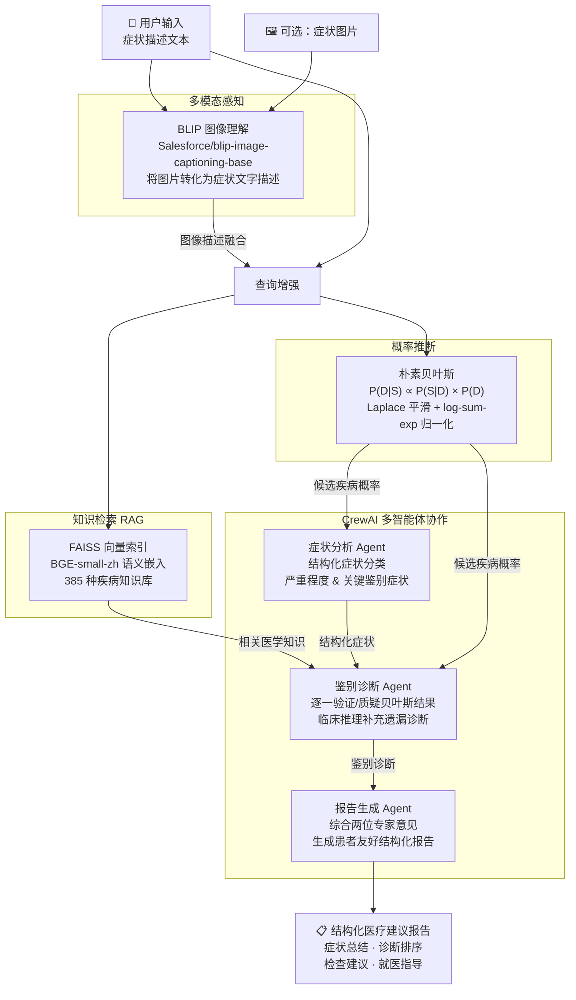

# 医疗多模态智能咨询系统

基于 **RAG 检索增强生成 + 朴素贝叶斯概率推断 + CrewAI 多智能体协作** 的症状分析平台，支持文本症状输入与图片多模态联合分析。

---

## 系统架构



---

## 技术栈

| 模块 | 技术 | 作用 |
|------|------|------|
| 前端界面 | Streamlit | 交互式 Web UI，展示中间结果和最终报告 |
| 多模态感知 | BLIP (Salesforce) | 将症状图片转化为文字描述，融入检索查询 |
| 语义检索 | FAISS + BGE-small-zh | 从 385 种疾病知识库中检索最相关内容 |
| 概率推断 | 朴素贝叶斯 | 计算每种疾病的后验概率，提供初步候选列表 |
| 多智能体 | CrewAI + DeepSeek | 三专科 Agent 分工协作，LLM 验证统计模型结果 |

---

## 项目结构

```
Medical-Agent-System/
├── app.py                          # Streamlit 前端入口
├── requirements.txt
├── .env                            # 存放 DEEPSEEK_API_KEY（不提交）
│
├── agents/
│   └── crew_system.py              # MedicalAgentSystem 类，多智能体编排
│
├── multimodal/
│   └── blip_analyzer.py            # BLIP 图像分析（懒加载）
│
├── probabilistic/
│   └── bayesian_diagnosis.py       # 朴素贝叶斯诊断引擎
│
├── rag/
│   ├── build_index.py              # 构建 FAISS 索引（离线执行一次）
│   ├── retriever.py                # 语义检索接口（懒加载）
│   ├── eval.py                     # 贝叶斯 + RAG 模块评测脚本
│   └── faiss_index.pkl             # 预构建的向量索引
│
└── data/
    └── medical_data.json           # 385 种疾病知识库
```

---

## 快速开始

### 1. 配置环境

```bash
# 克隆项目
git clone <repo-url>
cd Medical-Agent-System

# 创建并激活虚拟环境
python -m venv venv
venv\Scripts\activate        # Windows
# source venv/bin/activate   # macOS/Linux

# 安装依赖
pip install -r requirements.txt
```

### 2. 配置 API Key

在项目根目录创建 `.env` 文件：

```
DEEPSEEK_API_KEY=your_api_key_here
```

### 3. 启动应用

```bash
streamlit run app.py
```

### 4. 运行评测

```bash
python rag/eval.py
```

---

## 核心模块说明

### 贝叶斯诊断引擎

实现了严格遵循贝叶斯定理的朴素贝叶斯分类器：

```
P(疾病 | 症状) ∝ P(症状 | 疾病) × P(疾病)
```

**关键设计：**
- **均匀先验**：所有疾病初始概率相等（1/385）
- **Laplace 平滑**：`P(token|D) = (count + 1) / (total + |V|)`，避免零概率
- **Log 空间计算**：对数域相加代替原始域连乘，防止浮点下溢
- **log-sum-exp 归一化**：数值稳定地将 log 后验转换为归一化概率

### 多智能体协作设计

三个 Agent 具有**真正差异化的分工**，而非简单的流水线传递：

| Agent | 核心职责 | 关键能力 |
|-------|---------|---------|
| 症状分析 Agent | 症状结构化分类 | 按身体系统分类，识别关键鉴别症状 |
| 鉴别诊断 Agent | 验证与质疑贝叶斯结果 | 逐一分析支持/排除依据，补充遗漏诊断 |
| 报告生成 Agent | 综合报告撰写 | 整合双专家意见，生成患者可理解的建议 |

**核心创新**：鉴别诊断 Agent 会显式对贝叶斯概率模型的输出进行临床推理验证，体现"统计模型 + LLM 推理"的双重验证机制，避免单纯依赖概率数字做决策。

### RAG 检索

- 使用 `BAAI/bge-small-zh` 对 385 种疾病知识库生成语义向量
- FAISS `IndexFlatL2` 执行精确最近邻检索
- 查询时融合文本症状与图像描述，增强跨模态检索效果

---

## 评测结果

运行 `python rag/eval.py` 对贝叶斯和 RAG 模块进行定量评测。

评测设计：从数据集等间隔采样 20 个疾病，使用每个疾病**前 50% 的症状词**作为输入（模拟患者描述不完整的真实场景），验证系统是否能从部分信息中召回正确诊断。

```
评测指标：
  贝叶斯 Top-1 准确率：预测排名第一的疾病是否命中
  贝叶斯 Top-3 准确率：Top-3 结果中是否包含正确疾病
  RAG Top-3 召回率：  检索结果中是否出现正确疾病名称
```

---

## 设计局限与未来方向

- **知识库规模**：当前 385 种疾病以皮肤科为主，后续可扩充多科室数据
- **贝叶斯先验**：目前使用均匀先验，可引入流行病学发病率数据作为非均匀先验
- **多模态融合**：当前图像描述以拼接方式融入查询，未来可探索端到端跨模态嵌入
- **个性化诊断**：引入患者年龄、性别、既往病史等上下文信息

---

## 免责声明

> 本系统为学术研究项目，所有输出内容均由 AI 模型生成，**不构成任何医疗诊断建议**。如有健康问题，请及时就诊于正规医疗机构。
